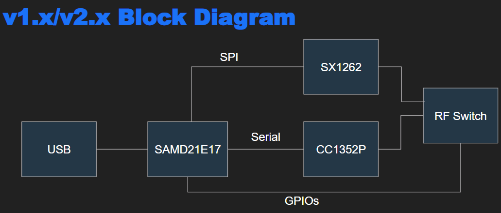
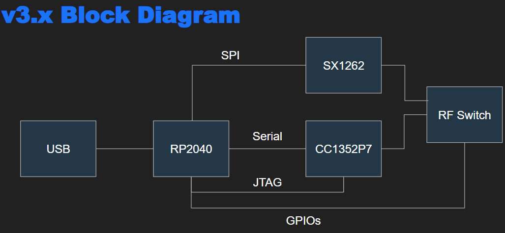

# CatSniffer firmware 

Here you will find the different firmwares for using this tool, it is important to note what CatSniffer version you own since the main microcontroller changed in v3.x we needed to keep track of compatibility between different processors and protocols.

## Firmware for different versions

For programming your CatSniffer you need to review what version do you own this is really important 

`IF YOU SELECT A DIFFERENT FIRMWARE VERSION THAN YOUR CATSNIFFER YOU WILL BIRCK IT`

If you have a bricked CatSniffer you can read the [wiki part to recover it](https://github.com/ElectronicCats/CatSniffer/wiki/08.-Restore-the-CC1352-firmware).

Each firmware folder includes the examples that are compatible with your board: 

- V1.x/V2.x for all version v1.x and v2.x, with SAMD and CC1352P1
- V3.x for version v3.x and further, with RP2040 and CC1352P7

## Understanding differences between v1.x/v2.x and v3.x
v1.x/2.x has as a main microcontroller one SAMD21E17A, from Microchip, allowing the communication between CC1352 and the USB serial, as well as the SPI to control the SX1262.

The SAMD21E17 can be programmed directly via USB with the [Electronic Cats SAMD Arduino Core](https://github.com/ElectronicCats/ArduinoCore-samd).

The CC1352P can be programmed via Serial using the [tool cc2538](../tools/cc2538-bsl/cc2538-bsl.py) with the specific hex file you want to flash, if you flash the CC1352 in a bad way, it may get stuck and it WILL NOT ALLOW YOU TO RE-PROGRAM BY BOOTLOADER, to re-flash the board you will need to erase the CC1352 with any cJTAG programmer, to enable the serial bootloader again, you can read more about this in the [wiki](https://github.com/ElectronicCats/CatSniffer/wiki/08.-Restore-the-CC1352-firmware).

v3.x has as a main microcontroller one RP2040, from Raspberry Pi, allowing the communication between CC1352 and the USB serial, as well as the SPI to control the SX1262.

The RP2040 can be programmed directly via USB with the [Arduino Mbed RP2040 Core](https://github.com/arduino/ArduinoCore-mbed), it is important to acknolage one [bug inside the Arduino Core for the RP2040](https://github.com/arduino/ArduinoCore-mbed/issues/532), and its mandatory to change one line of code inside the core.

The CC1352P can be programmed via Serial using the [tool cc2538](../tools/cc2538-bsl/cc2538-bsl.py) with the specific hex file you want to flash, if you flash in a bad way the CC1352, it may get stuck, in this version we included a JTAG connection to erase all the flash, to enable the serial bootloader again.

## CC1352P vs CC1352P7

The CC1352 chip has inside two ARM® Cortex® processors:

- Cortex®-M4F (Main processor with Flash to be programmed by user).
- Cortex®-M0 (Co-Processor with ROM, where all the RF Core lives, to be used by the user).

The most important difference between the two chip is the RF support written on the ROM, this cannot be changed more than in chip manufacture.

### CC1352P

Memory:
- 352KB Flash
- 80KB RAM
- 256KB ROM

Wireless protocols support:
- Thread, Zigbee® 
- Bluetooth® 5.2 Low Energy
- IEEE 802.15.4g 
- IPv6-enabled smart objects (6LoWPAN) 
- MIOTY®
- Wireless M-Bus 
- WiSUN®
- SimpleLink™ TI 15.4-Stack (Sub-1 GHz)
- Proprietary systems.
- Wireshark v3.0.x

### CC1352P7

Memory:
- 704KB Flash
- 144KB RAM
- 256KB ROM

Wireless protocol support:
- Thread, Zigbee®, Matter
- Bluetooth® 5.2 Low Energy
- Wi-SUN®
- MIOTY®
- Amazon Sidewalk
- Wireless M-Bus
- SimpleLink™ TI 15.4-stack
- 6LoWPAN
- Proprietary systems
- Wireshark v4.0.x

## Wiki and Getting Started

[Getting Started in our Wiki](https://github.com/ElectronicCats/CatSniffer/wiki)

## Note
This kit is designed to allow Product developers to evaluate electronic components, circuit, or software associated with the kit to determine whether to incorporate such items in a finished product and Software developers to write software applications for use with the end product. This kit is a developer product and when assembled may not be resold or otherwise marketed unless all required FCC (or any other local authority) equipment authorizations are first obtained. Operation is subject to the condition that this product not cause harmful interference to licensed radio stations and that this product accept harmful interference.

## License

Electronic Cats invests time and resources providing this open source design, please support Electronic Cats and open-source hardware by purchasing products from Electronic Cats!

Designed by Electronic Cats.

Firmware released under an GNU AGPL v3.0 license. See the LICENSE file for more information.

Hardware released under an CERN Open Hardware [Licence v1.2](https://github.com/ElectronicCats/CatSniffer/blob/master/LICENSE.md) See the LICENSE_HARDWARE file for more.
Electronic Cats is a registered trademark, please do not use if you sell these PCBs.

3 April 2021
