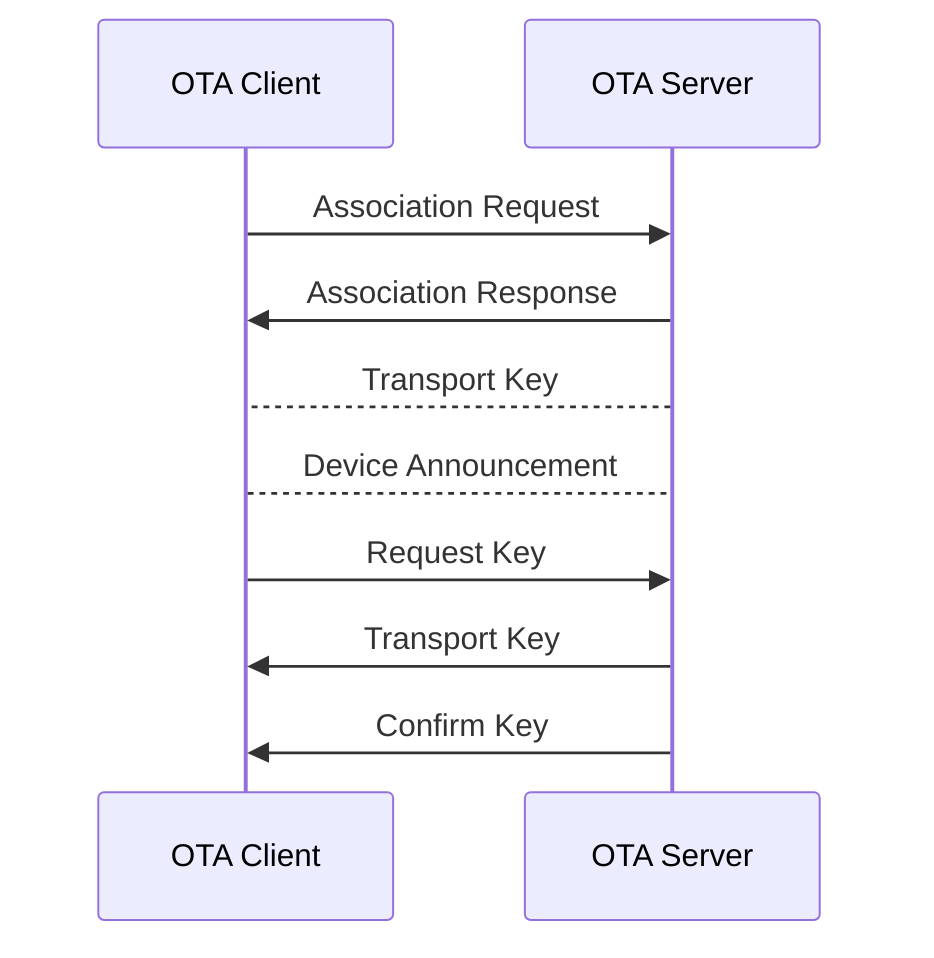
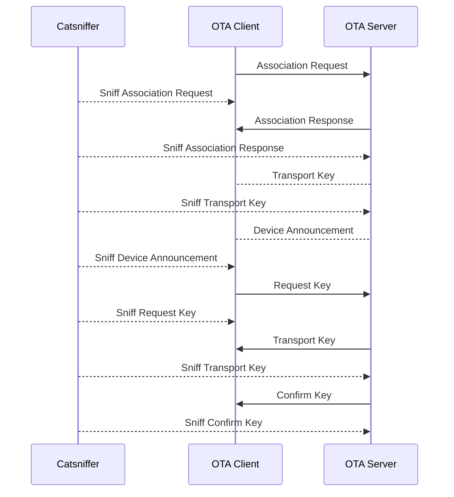
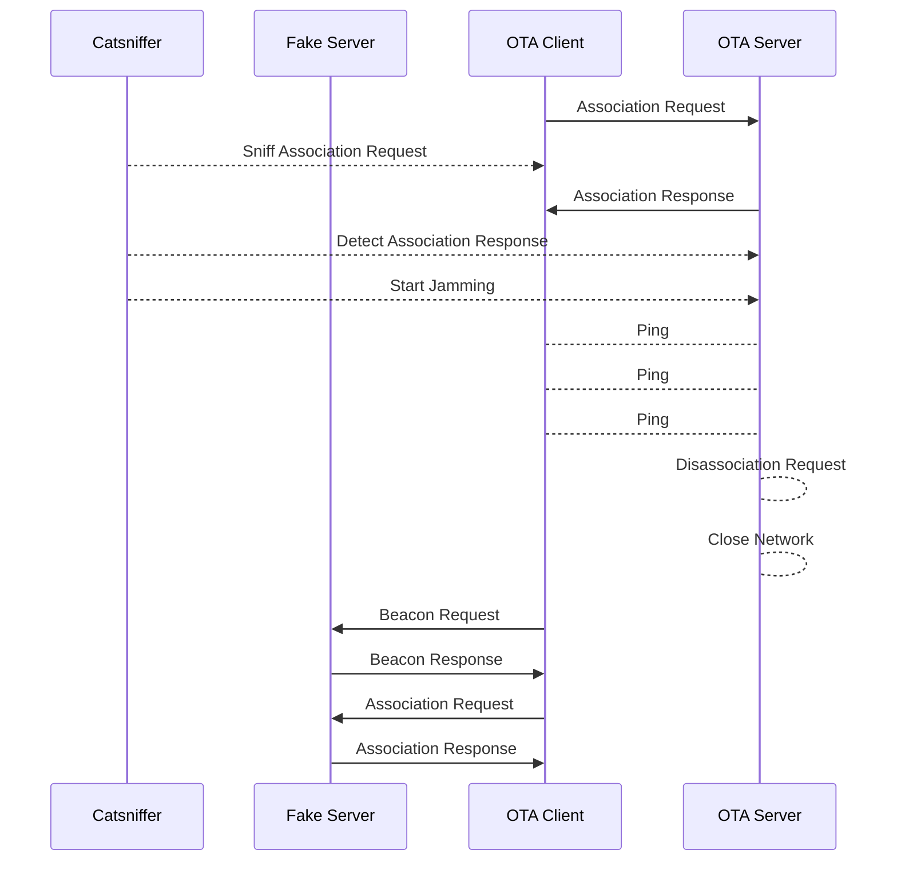

# CatSniffer MITM ZigBee OTA Server-Client
This PoC are using a ESP32-H2 and ESP32-C6 devices to show how you can sniff the network and in some point you can upload your custom firmware.

## Common ZigBee OTA Process




## CatSniffer MITM
### How the OTA update works



With the CatSniffer we are listening the channel where the OTA server was found, the main packets that we are focus on, are the `Transport Key` with this we can decrypt the information without using the `Zigbee09` key.

### Start sniffing
Use the Pycatsniffer we can sniff the channel by running:
```bash
python cat_sniffer.py sniff /dev/tty.usbmodem133401 -phy 1 -ch 15 -ff -ws 
```
Where:
- `-phy`: Protocol (IEEE 802.15.4)
- `-ch`: Channel where we want sniff
- `-ff`: Write a FIFO, for use with Wireshark
- `-ws`: Open Wireshark with the FIFO

or, using the extcap:
![[static/Running_catsniffer.gif]]

Once the Wireshark open, we start sniffing the network without a decryption key, a common packets are likes this:
![[static/Wireshar_packet_encrypt.png]]

To decrypt the communication, we can use the `ZigBee09` to configure we can follow the next steps:
- `Wireshark > Preferences > Protocols > ZigBee`
- Edit the *preconfigure keys*
- Add new entry
- Copy the Key value: `5A:69:67:42:65:65:41:6C:6C:69:61:6E:63:65:30:39`
- Add
- Close the protocols window
![[static/Wireshark_Key.gif]]

With this you can now start sniffing!

### View the OTA binary
When we are sniffing the network, if we are in the right moment where the `ZCL OTA: Image Notify` are detected, we can view all the packets with the information of the binary.

![[static/Wireshark_ota_packet.png]]

Our focus packets are the `ZCL OTA: Image Block Response`, this packets has the payload data for our binary information.
![[static/Wireshark_packet_information.png]]
The *Image Data* field, contains the information.

### Getting the OTA data to binary
#### Export the data
Once we had all the data complete we can export the collected data:
- Stop the capture if this still running
- `File -> Export Packet Dissections -> As JSON`
- Save in the directory where you want

![[static/Export_capture_json.gif]]
#### Create the binary
- Open a terminal
- Run the *decoder* with `decoder.py --file /path/to/the/file.json`
- Once the decoder finished, in the directory where this is executed will create two files, the `strings` and the `binary` file.
![[static/Run_decoder.gif]]
#### Compare the information
![[static/ota_binary.png]]
We can compare the binary file with the collected file.


# CatSniffer Targeting OTA Server
This PoC demonstrates how to use the CatSniffer to execute a jamming attack on a network, forcing the client to disconnect and reconnect to our OTA server, where it downloads and installs a custom firmware.

>[!NOTE]
>This PoC is based on the **CatSniffer MITM ZigBee OTA Server-Client**
## How the Attacks  works
This sequence describes a process where a CatSniffer and a jammer are used to disrupt an Over-The-Air (OTA) communication and redirect the client to a fake server for malicious purposes. Here's the description:

1. The **OTA Client** sends an **Association Request** to the legitimate OTA Server, initiating the connection.
2. The **CatSniffer** listens for the **Association Request** from the OTA Client and logs it.
3. The **OTA Server** responds to the client with an **Association Response**.
4. The **CatSniffer** detects the **Association Response** and immediately triggers the jammer, disrupting the communication channel.
5. While the client continues to send **Ping** requests to the legitimate server, the server issues a **Disassociation Request** to terminate the communication and closes the network.
6. After losing connection, the **OTA Client** searches for other available networks by sending a **Beacon Request**.
7. The **Fake Server** responds with a **Beacon Response**, signaling that it is available for the client to connect.
8. The **OTA Client** sends an **Association Request** to the **Fake Server**, starting the process of connecting to it, potentially leading to the installation of malicious firmware.

This workflow illustrates how jamming and packet sniffing are used to hijack a client's network connection and force it to communicate with a rogue server.



## The jammer
For this test I used a ESP32-WROOM and custom firmware with two NRF24 modules.

## Starting the attack
To start the attack we use the `Catbee` tool:
```shell
# Clone the repo
git clone https://github.com/JahazielLem/catbee.git
cd catbee
pip install -r requirements.txt
```
Then you need to specify the path to the CatSniffer, the Channel to sniff and the Jammer path
```shell
python3 catbee.py -cs /dev/tty.usbmodem1101 -csch 13 -jm /dev/tty.usbserial-0001 -jmb 115200
```
Where:
- `-cs`: Path to the comport of catsniffer
- `-csch`: Channel where catsniffer will sniff to find the `Association Request`
- `-jm`: Path to the comport of the jammer
- `-jmb`: Baudrate of the jammer if this work in a different value than `921600`

![[static/sending_attack.gif]]

Once the Catbee detect the `Association Response` start the jamming attack to the channel, so our rogue server can responde to the Client and the connection will be establish.

![[static/Finished.gif]]

>[!NOTE]
>I create my custom firmware to demonstrate how the OTA was loaded successfully