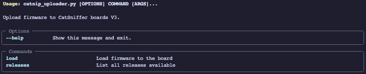
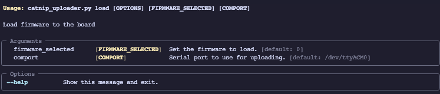

This script works to upload firmware from the releases page to the CatSniffer Board V3.x. 
>[!IMPORTANT]
>The current version of the **Catnip** requires the lasted version of the [**SerialPassthroughwithboot**](https://github.com/ElectronicCats/CatSniffer-Firmware/releases/download/board-v3.x-v1.1.0/SerialPassthroughwithboot_RP2040_v1.1.uf2)
## Getting Starter
The struct files from the repo is:
``` bash
.catnip-uploader:
├── catnip_uploader.py
├── cc2538.py
├── releases.json
└── requirements.txt
```

To initialize first we need to install de dependencies packets from the *requirements.txt*. 

>[!NOTE]
>We recommend use virtual environment to avoid dependencies errors.

To install de requirements run the next command:  `pip install -r requirements.txt`
Requirements packets:
- `typer==0.9.0`
- `pyserial==3.5`
- `requests==2.31.0`
- `intelhex==2.3.0`
- `python-magic==0.4.27`

>[!IMPORTANT]
>To install **python-magic** may have additional dependencies depending on your OS, [read more](https://github.com/ahupp/python-magic#dependencies): 

### Available commands


#### Releases

Show the current releases loaded from the board version 3
##### Usage
To show the current releases run the next command:
```bash
$> python3 catnip_uploader.py releases
Releases available:
0: airtag_scanner_CC1352P_7.hex
1: airtag_spoofer_CC1352P_7.hex
2: sniffer_fw_CC1352P_7.hex
3: sniffle_CC1352P_7.hex
```
#### Load

Load  the selected firmware to the board, this command have two options.
- **Firmware**: This options is a integer value from the index of the available firmware releases
- **Comport**: The Path to the board serial com
##### Usage
>[!NOTE]
>First you need to know the index of the firmware you want to upload, exec the **releases** command if you don't know what index you need.

```bash
$> python3 catnip_uploader.py load 0 /dev/cu.usbmodem101
Uploading airtag_scanner_CC1352P_7.hex to /dev/cu.usbmodem1101
Downloading airtag_scanner_CC1352P_7.hex
Uploading airtag_scanner_CC1352P_7.hex to /dev/cu.usbmodem1101
Opening port /dev/cu.usbmodem1101, baud 500000
Reading data from firmware.hex
Firmware file: Intel Hex
Connecting to target...
CC1350 PG2.0 (7x7mm): 704KB Flash, 20KB SRAM, CCFG.BL_CONFIG at 0x000AFFD8
Primary IEEE Address: 00:12:4B:00:2A:79:C0:96
    Performing mass erase
Erasing all main bank flash sectors
    Erase done
Writing 720896 bytes starting at address 0x00000000
Write 208 bytes at 0x000AFF300
    Write done                                
Verifying by comparing CRC32 calculations.
    Verified (match: 0x99d1c8f1)
Done uploading airtag_scanner_CC1352P_7.hex to /dev/cu.usbmodem1101 
```

After finished you can use the CatSniffer with the selected firmware.