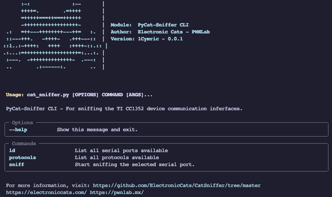
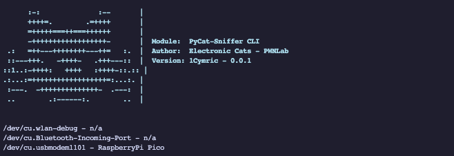
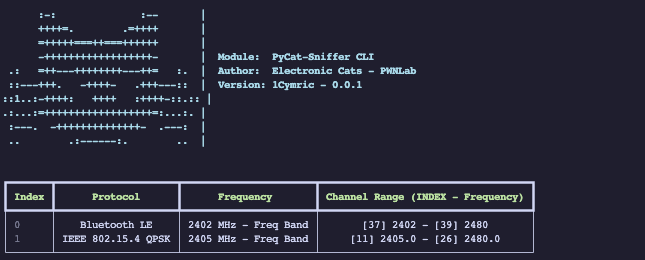
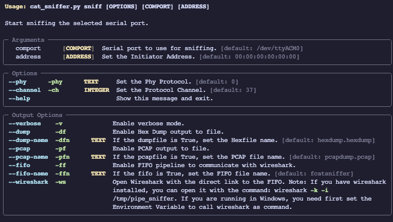

# PyCatsniffer tool


This tools is Command Line Interface (CLI) to communicate with the [**Sniffer_fw_CC1352P_7 firmware**](https://github.com/ElectronicCats/CatSniffer-Firmware/releases/) that you can upload with out catnip tool.

# Features
- This tool actually supports the next protocols:
	- Bluetooth Low Energy (BLE)
	- IEEE 802.15.4
	- ZigBee
- Multi platform support
- Direct wireshark communication with PIPE's
- Dump the received packets in:
	- Pcap Format
	- Hex Format

# Getting Starter
## Requirements
To install the requirements we need first [**Python 3**](https://www.python.org) installed and the environment variable to call python.
To initialize first we need to install de dependencies packets from the *requirements.txt*.

>[!NOTE]
>We recommend use virtual environment to avoid dependencies errors.

To install de requirements run the next command:  `pip install -r requirements.txt`
If all the requirements are satisfactory installed we can proceed to running the script.

## Setting up the Environment

### Wireshark
#### Set the Dissector
We need to copy the three .lua files dissector to be able to read the information.
```bash
.dissectors:
├── catsniffer-blepi.lua
├── catsniffer-register.lua
└── catsniffer-rpi.lua
```

To copy the dissectors content we need to:
- Open Wireshark
- `Wireshark > About > Folders`
- Double click on the `Personal Lua Plugins` path (this create the folder path)
- Copy the content inside the *dissectors folder* into the **Personal Lua Plugins** folder
- Restart Wireshark

#### Configure the DLT 147 value
To use wireshark and show the information we need to configure the USER DLT value to redirect the sniffer packet to the dissectors files.
- Open Wireshark
- `Preferences > Protocols > DLT_USER`
- Click on the `Edit...` button
- Create new entry
- The entry value are defined as:
	- DLT: User 0 (DLT=147)
	- Payload dissector: catsniffer_rpi
	- Header size: 0
- Click in *Ok* button
- Click in *Ok* button
## Available Commands
### List Devices - ld

```bash
$ python cat_sniffer.py ld
```


This commands show the available com ports, running this command we can view what port is available and if our CatSniffer is connected.

### Protocols - protocols
```bash
$ python cat_sniffer.py protocols
```

This command show the available protocols and description about the supported channels.

The command show a table with the information about the protocol support.
- **Index**: The index value to used when a [sniff](#) command is called.
- **Protocol**: Protocol name
- **Frequency**: The base frequency of the protocol
- **Channel Range**: Show the relation of the channel and the frequency, the index value is used in the *sniff* command to select the channel to sniff.

>[!NOTE]
>The Channel Range is showed in the min value and max value of the channel range available in the protocol.

### Sniffer - sniff

```bash
$ python cat_sniffer.py sniff --help
```



This commands initialize the sniff communication with the board, to start the sniffing the command requires some initial configuration.

#### Arguments:
- **comport**: This value is the path to the board serial com
- **address (experimental)**: This value is the MAC address of the device to follow the connection

#### Options
- **phy**: This value set the phy value, as refers in the [protocols section] correspond to the index value.
- **channel**: This is the value from the channel to sniff, this index values are showed in the protocols section.

When a different *phy* is selected, we need to specify the channel to sniffing.

#### Output Options
- **verbose**: Show the sniffed packets in the console.
- **dump**: Is a flag value, if we write this will generate a dump hex file
- **dump-name**: Is the flag value, if we write this with a value change the default dump name.
- **pcap**: Is a flag value, if we write this will generate a dump pcap file
- **pcap-name**: Is the flag value, if we write this with a value change the default dump name.
- **fifo**: This flags set a pipe line to communicate with wireshark
- **fifo-name**: Set the name of the pipe
- **wireshark**: This open a wireshark in the same thread of the script and open automatically the fifo. (Require the -ff option to open)

>[!IMPORTANT]
>If your are in windows to call Wireshark from the terminal you need to set the installation path to the Environmental Variables

### Examples calls

$SERIAL_PORT will be depending on your OS please check your serial port name by: 

```bash
$ python cat_sniffer.py ld
```


Default sniffing
- Protocol: BLE
- Channel: 37
- Verbose
```bash
$ python3 cat_sniffer.py sniff $SERIAL_PORT -v
```

Dump a pcap file with different BLE channel
- Protocol: BLE
- Channel: 39
- Dump File
```bash
$ python3 cat_sniffer.py sniff $SERIAL_PORT -ch 39 -df
```

Default sniffing
- Protocol: BLE
- Channel: 37
- Wireshark
```bash
$ python3 cat_sniffer.py sniff $SERIAL_PORT -phy 0 -ch 39 -ff -ws 
```

Dump a pcap file, hex file with custom name and IEEE 802.15.4 protocol
```bash
$ python3 cat_sniffer.py sniff $SERIAL_PORT -phy 1 -ch 11 -pf -df -dfn test.pcap
```

Dump a pcap file, hex file, verbose mode and show the packets on wireshark
```bash
$ python3 cat_sniffer.py sniff $SERIAL_PORT -df -pf -ff -ws
```
